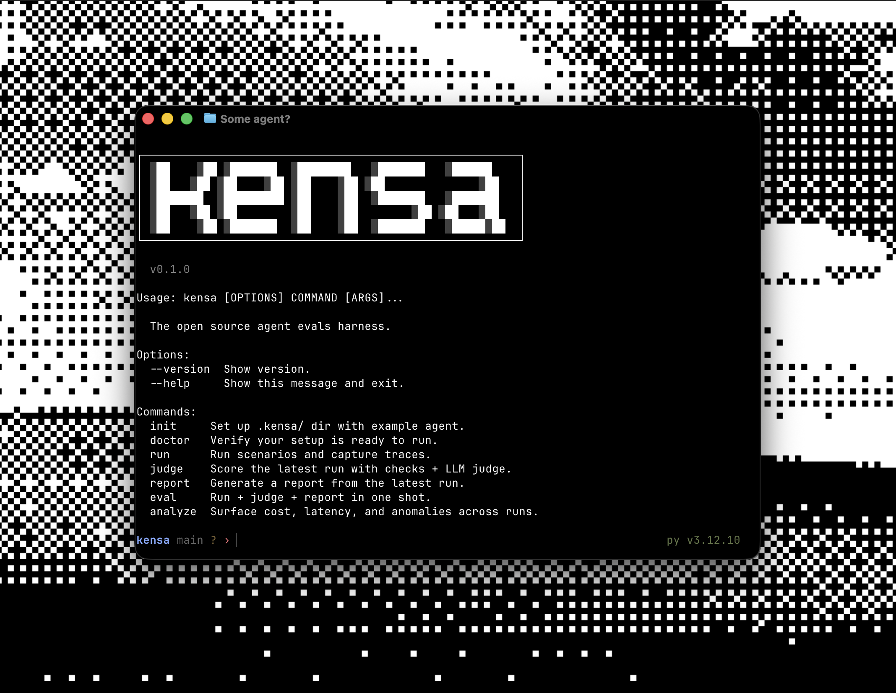

<div align="center">

<br>

<br><br>

<p>Tell your coding agent to evaluate an agent. Get a working eval suite in minutes.</p>

<p>
<a href="https://github.com/satyaborg/kensa/actions/workflows/ci.yml"></a>
<a href="https://pypi.org/project/kensa/"></a>
<a href="https://www.python.org/downloads/"></a>
<a href="LICENSE"></a>
</p>

</div>

Agent evals have a cold-start problem. Manual prompting is noisy and non-deterministic, but building a full eval harness from scratch is too much overhead for fast shipping teams.

`kensa` is an opinionated CLI with bundled skills for evaluating agent codebases with tools your team already uses, like Claude Code and Codex.

That gets you from zero to an eval loop without building a custom harness first.

- Tell your coding agent to evaluate the repo.
- It reads the codebase and traces, identifies failure modes, and writes scenarios and judges.
- Runs the evals with `kensa`.
- You review and approve fixes, then it runs them again.

Works with all major coding agents that support skills and bash commands.

---

## Installation

### Skills + CLI (recommended)

```bash
npx skills add satyaborg/kensa   # install eval skills
uv add kensa                     # or: pip install kensa
```

This is the recommended setup for Codex, Cursor, OpenCode, Gemini CLI, and other agents. Installs five skills (`audit-evals`, `generate-scenarios`, `generate-judges`, `validate-judge`, `diagnose-errors`) plus the `kensa` CLI runtime.

### Claude Code plugin

If you primarily use Claude Code, you can install `kensa` as a plugin instead:

```text
/plugin marketplace add satyaborg/kensa
/plugin install kensa
```

### Provider extras

Install the extra that matches your stack:

```bash
uv add "kensa[anthropic]"
uv add "kensa[openai]"
uv add "kensa[langchain]"
uv add "kensa[all]"
```

---

We're continuing to add more model providers and frameworks.

## Quickstart

### 1. Ask your coding agent to evaluate the repo. For e.g.

```text
> evaluate this agent
```

That is the primary workflow. The bundled skills inspect the codebase, scaffold `.kensa/`, and generate scenarios and judges.

### 2. Add instrumentation if needed

Coding agents will automatically add missing instrumentation but you can also manually setup `instrument()` before importing your LLM SDK like so:

```python
from kensa import instrument

instrument()
```

Manual setup mainly applies if you use `kensa` without the skills flow.

### 3. Run the evals

```bash
kensa eval
```

That runs the scenarios, applies checks, calls the judge if needed, and writes results you can inspect with `kensa report`.

Deterministic checks run before the LLM judge, so failures short-circuit without spending tokens.

### 4. Fix and iterate

Use the report output to tighten prompts, tools, and guards, then ask the coding agent to update the evals or diagnose failures.

---

## Manual CLI Workflow

If you want to author evals and set up instrumentation by hand:

```bash
kensa init --blank
kensa doctor
```

Then create, for example: `.kensa/scenarios/classify_ticket.yaml`:

```yaml
id: classify_ticket
name: Support ticket triage
description: Classify a support ticket by severity.
source: user

input: "Our entire team can't log in. SSO has returned 502 since 7am."
run_command: python agent.py {{input}}

expected_outcome: Agent returns the correct priority label.

checks:
  - type: output_matches
    params: { pattern: "^P[123]$" }
    description: Output must be exactly P1, P2, or P3.
  - type: max_cost
    params: { max_usd: 0.05 }
    description: Stay under five cents.

criteria: |
  P1 is for outages or data loss affecting multiple users.
  The agent must classify based on business impact, not tone.
```

---

## What You Type -> What Happens

```text
$ npx skills add satyaborg/kensa
→ Installs the coding-agent skills that drive the eval workflow

$ uv add kensa
→ Adds the runtime that executes scenarios, judges, and reports

$ "evaluate this agent"
→ Your coding agent inspects the repo, writes evals, and helps run them

$ kensa eval
→ Runs scenarios, applies checks, calls the judge when needed, and writes a report

$ kensa analyze
→ Surfaces slow, expensive, flaky, or error-prone traces
```

---

## Core Commands

| Command | What it does |
| --- | --- |
| `kensa init` | Scaffold with an example agent and scenario |
| `kensa init --blank` | Scaffold directories only |
| `kensa doctor` | Check instrumentation, config, and environment readiness |
| `kensa run` | Execute scenarios and capture traces |
| `kensa judge` | Run deterministic checks and, if configured, an LLM judge |
| `kensa report` | Generate terminal, Markdown, JSON, or HTML output |
| `kensa eval` | Run + judge + report in one command |
| `kensa analyze` | Flag cost, latency, error, and looping anomalies in traces |

`kensa` helps you test an agent the same way you test the rest of your software: with repeatable scenarios, clear pass/fail signals, and reports you can use in CI.

---

## Architecture

<div align="center">

</div>

In practice, agent evals often force a choice between vibes and infrastructure: either you test them manually in prompts, or you spend weeks building a harness before you learn anything.

`kensa` exists to close that gap. The coding agent reads the codebase, identifies failure modes from past traces, and writes scenarios. The CLI runs those scenarios in subprocesses, captures traces, applies deterministic checks, and only calls the LLM judge when the cheap checks pass. The bundled skills connect those steps into a usable eval loop instead of leaving you to wire it together by hand.

That split is intentional:

- the coding agent decides what is worth testing
- the CLI executes the eval suite consistently
- the skills drive setup, scenario generation, judge authoring, and iteration
- deterministic checks gate expensive judge calls
- reports and traces make the results usable in CI and iteration

---

## Scenario format

Scenarios live in `.kensa/scenarios/*.yaml`. You can write a single input by hand, or point at a dataset so one scenario definition expands into many runs.

Example dataset-driven scenario:

```yaml
id: booking_variations
name: Booking across routes
dataset: data/routes.jsonl
input_field: query
run_command: python agent.py {{input}}

checks:
  - type: tool_called
    params: { name: search_flights }
  - type: max_turns
    params: { max: 5 }

criteria: |
  The agent must confirm with the user before booking.
  The final answer must include a confirmation number.
```

Built-in checks:

| Check | What it tests |
| --- | --- |
| `output_contains` | Output includes a string or pattern |
| `output_matches` | Output matches a regex |
| `tool_called` | A specific tool was invoked |
| `tool_not_called` | A specific tool was not invoked |
| `tool_order` | Tools were called in the expected sequence |
| `max_cost` | Total cost stays under a threshold |
| `max_turns` | LLM call count stays under a limit |
| `max_duration` | Execution time stays under a limit |
| `no_repeat_calls` | Duplicate tool calls with identical args are rejected |

A scenario passes when every configured check passes and any configured judge passes.

---

## Examples

The repo includes five example agents under [`examples/`](examples/):

| Example | What it tests |
| --- | --- |
| [`sql-analyst`](examples/sql-analyst) | Multi-tool SQL analysis with soft-delete, currency, and aggregation traps |
| [`incident-triage`](examples/incident-triage) | Operational diagnosis across runbooks, deploys, metrics, and paging |
| [`code-reviewer`](examples/code-reviewer) | Review behavior, false positives, and missed security issues |
| [`customer-support`](examples/customer-support) | Refunds, policy checks, ticket routing, and flaky downstream tools |
| [`sdr-qualifier`](examples/sdr-qualifier) | Qualification logic, CRM hygiene, and competitor signals |

Try one:

```bash
git clone https://github.com/satyaborg/kensa.git
cd kensa
uv sync --extra openai
cd examples/sql-analyst
```

Then ask your coding agent to evaluate it, or write scenarios yourself and run `kensa eval`.

---

## CI

```yaml
- name: Run evals
  run: uv run kensa eval --format markdown
```

If you only use deterministic checks, you do not need API keys. If your scenarios include `criteria` or `judge`, add judge provider secrets in CI.

---

## Contributing

See [CONTRIBUTING.md](CONTRIBUTING.md) for the full guide.

```bash
git clone https://github.com/satyaborg/kensa.git
cd kensa
uv sync --extra dev
pre-commit install
pytest -m "not integration"
ruff check src/ tests/
ruff format --check src/ tests/
uv run ty check
```

---

<details>
<summary>Judge model resolution</summary>

1. `KENSA_JUDGE_MODEL` override
2. `ANTHROPIC_API_KEY` -> `claude-sonnet-4-6`
3. `OPENAI_API_KEY` -> `gpt-5.4-mini`
4. Neither -> setup error

</details>

<details>
<summary>OpenTelemetry notes</summary>

kensa writes standard OpenTelemetry spans as JSONL and works well with OpenInference instrumentors. Auto-instrumentation currently supports Anthropic, OpenAI, and LangChain. If you already export spans yourself, you can still feed JSONL traces into kensa via `KENSA_TRACE_DIR`.

</details>

[Homepage](https://kensa.sh) · [Issues](https://github.com/satyaborg/kensa/issues) · [MIT License](LICENSE)
