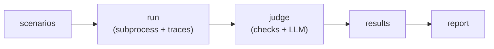

## Directory layout

Everything lives under `.kensa/` in your project root:

```bash
.kensa/
├── scenarios/   # YAML scenario definitions
├── agents/      # agent entry points (optional)
├── judges/      # structured judge specs (optional)
├── traces/      # JSONL span files (generated)
├── runs/        # run manifests (generated)
├── results/     # evaluation results (generated)
└── reports/     # standalone HTML reports (generated; markdown and JSON go to stdout or `-o`)
```

You write scenarios and (optionally) judge specs. Kensa generates everything else.

## Scenarios

A scenario defines a single test case: an input, a command to run, and how to evaluate the result.

```yaml
id: classify_ticket
input: "Our entire team can't log in. SSO has returned 502 since 7am."
run_command: [python, agent.py]
checks:
  - type: output_matches
    params: { pattern: "^P[123]$" }
criteria: |
  P1 is for outages affecting multiple users.
```

Scenarios can be generated by your coding agent (source: `code` or `traces`) or written by hand (source: `user`). See [Scenarios](/scenarios) for the full field reference.

## Spans and traces

When a scenario runs, kensa launches the agent in a subprocess and auto-instruments it. LLM calls, tool use, and timing are captured as spans and written as JSONL.

A **span** represents one unit of work:

| Kind | What it captures |
|---|---|
| `llm` | Model call - model name, tokens, cost, latency |
| `tool` | Tool invocation - name, arguments, result |
| `agent` | Top-level agent span (parent of all others) |
| `chain` | Orchestration step (e.g. LangChain chain) |
| `retriever` | RAG retrieval step |
| `evaluator` | Evaluation or scoring step emitted by the traced system |

These span kinds follow the [OpenInference](https://github.com/Arize-ai/openinference) semantic conventions, which extend OpenTelemetry with AI-specific span types.

Spans form a tree via parent/child relationships. Kensa reads the JSONL after execution and translates it to an internal format for checks and judging.

## Checks

Checks are deterministic, free, and fast. They answer binary questions about the execution:

- **Output checks**: Does the output contain a string? Match a regex?
- **Tool checks**: Was a tool called? In the right order? Without duplicates?
- **Trajectory checks**: Did the overall tool-call path match the expected sequence and stay within inline budgets?
- **Resource checks**: Under cost limit? Under turn limit? Under time limit?

See [Checks](/checks) for the full list of check types.

Checks run before the judge. If any check fails, the scenario fails immediately. No tokens spent on judging.

## Judge

The judge is an LLM that evaluates subjective criteria against the execution trace. It receives the scenario input, expected outcome, agent output, tool calls, and your criteria. It returns binary pass/fail with written reasoning.

Two ways to define criteria:

- **Inline**: Write criteria directly in the scenario's `criteria` field.
- **Structured**: Define a reusable judge spec in `.kensa/judges/` with pass/fail definitions and few-shot examples. Reference it via the scenario's `judge` field.

`criteria` and `judge` are mutually exclusive. See [Judge](/judge) for model resolution and spec format.

## Results

A result combines check outcomes and judge verdict into a single status:

| Status | Meaning |
|---|---|
| `pass` | All checks passed AND judge passed (or no criteria set) |
| `fail` | At least one check failed, or the judge failed |
| `error` | Agent crashed or timed out |
| `uncertain` | Judge couldn't reach a verdict |

Results are stored as JSON in `.kensa/results/` and can be rendered as terminal output, markdown, JSON, or a standalone HTML dashboard.

## Runs and aggregation

Each `kensa run` invocation produces a **run manifest**, a record of which scenarios ran, their trace paths, exit codes, and durations.

Repeated runs give you more traces to inspect with `kensa analyze`, which currently surfaces
trace-level cost and latency distributions, tool usage, success rate, and anomaly flags.

When a scenario uses a `trajectory` check, result reports also surface
`trajectory_accuracy` and `step_efficiency` alongside pass/fail.

## Evaluation pipeline

The full pipeline in one diagram:



`kensa eval` runs all three stages in sequence. Each stage can also be invoked independently for debugging or CI integration.
