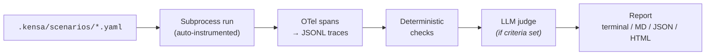

Kensa is the open source harness for evaluating coding agents with real execution traces, deterministic checks, and LLM-as-judge scoring.

<Check>If you want the fastest path to value, start with [Quickstart](/quickstart). Most teams can get to a first eval in a few minutes.</Check>

<Columns cols={2}>
  <Card title="Run your first eval" href="/quickstart" cta="Open quickstart" arrow="true">
    Install kensa, add the provider extra that matches your stack, and evaluate a real repo.
  </Card>
  <Card title="Learn the mental model" href="/concepts" cta="Read concepts" arrow="true">
    Understand how scenarios, traces, checks, judges, and reports fit together.
  </Card>
  <Card title="Pick a workflow" href="/workflows" cta="Compare workflows" arrow="true">
    Start with skills, drop down to the CLI, wire up MCP, or gate changes in CI.
  </Card>
  <Card title="Try a realistic example" href="/examples" cta="Explore examples" arrow="true">
    Use one of the included example agents to see the full loop on a codebase with real stakes.
  </Card>
</Columns>

## What kensa does

<Columns cols={3}>
  <Card title="Generate scenarios">
    Your coding agent can inspect the codebase and existing traces to write baseline or targeted scenarios in `.kensa/scenarios/`.
  </Card>
  <Card title="Capture execution traces">
    Each scenario runs in its own subprocess, auto-instrumented with OpenTelemetry so kensa can see tool calls, latency, cost, and span structure.
  </Card>
  <Card title="Score outcomes">
    Deterministic checks fail fast, and only then does the judge spend tokens on natural-language criteria when you need subjective evaluation.
  </Card>
</Columns>

## Where to start

| If you want to | Go to |
|---|---|
| Get running in under a minute | [Quickstart](/quickstart) |
| Understand the mental model | [Concepts](/concepts) |
| See the full eval workflow | [Workflows](/workflows) |
| Look up exact commands | [CLI Reference](/cli) |
| Drive kensa from an MCP client | [MCP Server](/mcp) |

## Why teams use it

- Cold-start friendly: kensa can start from code understanding even when you have no labels and no existing eval harness.
- Trace-informed iteration: previous runs become input for better scenarios instead of dead artifacts.
- Cost-aware by default: checks gate the expensive judge call, so obvious failures do not spend tokens.
- Works with existing tooling: use it through skills, the CLI, MCP, or CI depending on how your team already operates.

## It gets smarter each run

Feed traces from previous runs back in, and kensa generates scenarios targeting real failure modes instead of educated guesses.

```text title="Eval loop"
Run 1 (cold-start):    code → baseline scenarios → traces (1)
Run 2 (with traces):   code + traces (1) → better scenarios → traces (2)
Run 3:                 code + traces (1,2) → even better scenarios
```

## Data flow



Each scenario runs in its own subprocess. kensa auto-instruments the agent's LLM SDK, captures spans as JSONL, and translates them to its internal format.

Checks are deterministic, cheap, and fast. They gate the expensive LLM judge call. If a check fails, the scenario fails immediately without spending tokens.

A scenario passes only when **all checks pass and the judge passes**. If a deterministic check fails, the judge is skipped and no extra tokens are spent.

## Compatible coding agents

Kensa works with any coding agent that can run shell commands and use skills, including Claude Code, Codex, Cursor, OpenCode, and Gemini CLI.

## License

MIT. The only cost is LLM API calls for judge criteria, and that's optional.
